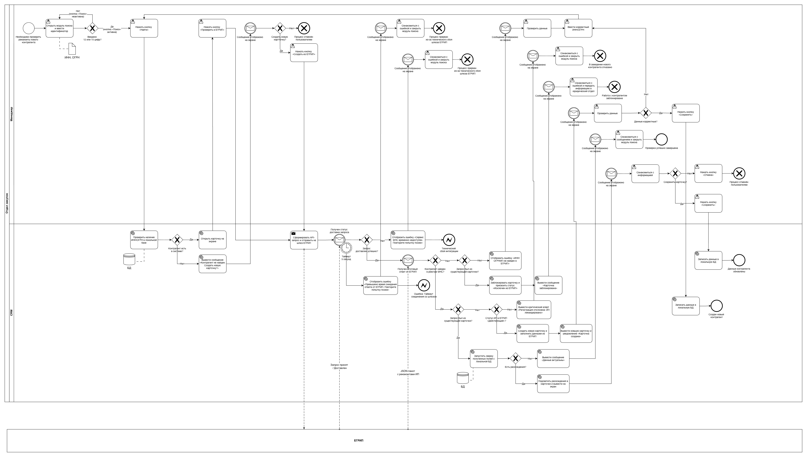

# Кейс: Модуль автоматической верификации контрагентов (ИП) через интеграцию со шлюзом ЕГРИП

## 1. Входные и выходные данные процесса

Для реализации интеграции локальной CRM/ERP-системы торговой компании со шлюзом ЕГРИП (ФНС) необходимо четко разграничить потоки данных на входе и выходе автоматизируемого контура.

### 📥 Входные данные (Данные, поступающие на вход процесса)
Чтобы запустить процесс верификации контрагента, пользователю или системе достаточно передать один из ключевых уникальных идентификаторов.

| Название поля | Тип данных | Обязательность | Описание / Правила валидации |
| :--- | :--- | :--- | :--- |
| **ИНН ИП** | Строка (String) | Обязательно (если нет ОГРНИП) | Идентификационный номер налогоплательщика. Строго 12 цифр. Масочный ввод. |
| **ОГРНИП** | Строка (String) | Обязательно (если нет ИНН) | Основной государственный регистрационный номер ИП. Строго 15 цифр. |
| **id_operator** | Число (Integer) | Обязательно | Уникальный ID менеджера по закупкам, запустившего проверку из интерфейса карточки контрагента. |

### 📤 Выходные данные (Данные, формируемые на выходе процесса)
После успешного выполнения запроса внешняя государственная система ЕГРИП возвращает структурированный пакет (JSON/XML), содержащий актуальные официальные реквизиты предпринимателя на текущую дату.

| Название поля | Тип данных | Описание / Бизнес-смысл | Пример значения |
| :--- | :--- | :--- | :--- |
| **status_egrip** | Строка (String) | Текущий статус регистрации бизнеса | `Действующее` / `Прекратило деятельность` |
| **fio_ip** | Строка (String) | Полные ФИО индивидуального предпринимателя | `Иванов Петр Сергеевич` |
| **reg_date** | Дата (Date) | Официальная дата регистрации ИП в налоговой | `2021-04-12` |
| **termination_date**| Дата (Date) | Дата закрытия ИП (заполняется, только если статус `Ликвидирован`) | `2026-03-01` (или `null`) |
| **okved_main_code** | Строка (String) | Код основного вида экономической деятельности | `47.71` |
| **okved_main_name** | Строка (String) | Текстовое описание вида деятельности | `Торговля розничная одеждой в специализированных магазинах` |
| **verification_result**| Строка (String) | Итог автоматической сверки систем (формирует локальная система) | `Расхождений не обнаружено` / `Обнаружены расхождения данных` |

---

## 2. Сценарий взаимодействия: действия Пользователя и Системы

Процесс верификации и заведения контрагентов разделен на следующие этапы:

| № этапа | Название этапа | Действия Пользователя (Менеджера) | Действия локальной Системы (CRM) |
| :--- | :--- | :--- | :--- |
| **1** | **Ввод ИНН и валидация** | Открывает модуль «Проверка контрагентов» и начинает вводить ИНН (или ОГРНИП). | **Фронтенд-валидация:** В реальном времени проверяет маску. Пока не введено строго 12 цифр (для ИНН) или 15 (для ОГРНИП) — ромб логики интерфейса держит кнопку «Проверить» неактивной (серой). |
| **2** | **Инициация проверки** | Вводит корректное количество цифр (кнопка становится активной) и нажимает кнопку **«Проверить»**. | Блокирует интерфейс от повторных кликов и запускает внутренний Script Task для поиска ИНН в локальной базе данных. |
| **3** | **Развилка контекста (Поиск в БД)** | *Ожидает реакции системы.* | **Контекст А (Контрагент найден):** Выводит старую карточку на экран в белый конверт. **Контекст Б (Контрагент НЕ найден):** Выводит диалоговое окно «Создать новую карточку?». |
| **4** | **Реакция Менеджера на контекст** | • В Контексте А: Изучает данные и нажимает **«Обновить из ЕГРИП»**. • В Контексте Б: Нажимает **«Создать и заполнить»** (или «Отмена» ➡️ уход в Cancel End Event). | При получении клика «Обновить» или «Создать» запускает `Send Task` (темный конверт) — упаковывает API-запрос и отправляет его по REST API на шлюз ФНС (ЕГРИП). |
| **5** | **Ожидание квитанции и данных** | *Ожидает обработки запроса государственным реестром.* | Переходит в асинхронное ожидание (Message Catch Events): 1. Ловит квитанцию доставки. При превышении **таймаута в 5 сек** через Boundary Timer уводит процесс в ошибку. 2. Ловит итоговый JSON-пакет. При превышении **таймаута в 10 сек** сбрасывает сессию. |
| **6** | **Проверка результатов ФНС** | *Ожидает автоматической верификации реестра.* | Запускает цепочку ромбов-проверок прилетевшего пакета: • **ИП не найдено в ЕГРИП:** Передает ошибку в белый конверт менеджера. Менеджер уходит закрывать модуль, CRM блокирует процесс. • **ИП Ликвидировано:** CRM запускает блокировку (если старый) или алерт отмены (если новый). Менеджер уходит к Юристам/СБ, процесс завершается крестиком. |
| **7** | **Сверка и автозаполнение** | *Ожидает финального рендеринга данных.* | Если ИП действующее, CRM сверяет контекст запуска (Этап 3): • **Для нового ИП:** Автоматически создает карточку и заполняет пустые поля официальными данными. • **Для старого ИП:** Скрипт посимвольно сравнивает поля и включает цветную UX-подсветку расхождений. |
| **8** | **Финальное решение и сохранение** | Изучает готовую карточку на экране и нажимает либо кнопку **«Сохранить контрагента»**, либо кнопку **«Отмена»**. | Выводит финальный экран в белый конверт менеджера: • При клике «Сохранить» — делает `UPDATE/INSERT` в локальную БД карточек (успешный `End Event`). • При клике «Отмена» — сбрасывает временный буфер памяти и закрывает форму без изменений (выход в `Cancel End Event` с крестиком). |

### ⚠️ Обработка альтернативных и негативных сценариев (Бизнес-логика)

В процессе верификации система может столкнуться со следующими отклонениями от стандартного процесса:

1. **Сценарий А: Контрагент исключен / не найден в реестре ЕГРИП**
   * *Логика системы:* Ромб «Контрагент найден в реестре ФНС?» уходит по ветке «НЕТ». CRM проверяет контекст запуска. Если контрагент новый — выводится алерт и форма закрывается. Если контрагент существовал в нашей базе — CRM присваивает карточке критический статус «Исключен из ЕГРИП» и блокирует её. Через белый конверт Менеджер получает задачу: *«Передать данные в Службу безопасности и Юридический отдел для расследования»*. Процесс завершается через `Cancel End Event` (крестик).
   
2. **Сценарий Б: Статус ИП в ЕГРИП — «Прекратило деятельность» (Ликвидировано)**
   * *Логика системы:* Ромб «ИП действующее?» уходит по ветке «НЕТ». Если контрагент новый — база данных остается чистой, менеджер закрывает форму. Если контрагент старый — CRM блокирует карточку в БД, запрещает создание договоров и отгрузки. Менеджер получает алерт и направляется к Юристам для аннулирования действующих контрактов. Завершение процесса — `Cancel End Event` (крестик).
   
3. **Сценарий В: Технический сбой шлюза ЕГРИП или превышение времени ожидания (Таймаут)**
   * *Логика системы:* Если первая квитанция не пришла за 5 секунд или итоговый пакет не получен за 10 секунд, срабатывают прикрепленные к контуру часики `Boundary Timer Events`. Поток управления уходит в обход основного процесса. CRM выводит на экран ошибку: *«Превышено время ожидания ответа от госоргана»*, разблокирует строку поиска, а процесс уничтожается в `Error End Event` (кружок с молнией).

4. **Сценарий Г: Отмена сохранения карточки пользователем на финальном этапе**
   * *Логика системы:* Если на финальном этапе отображения верифицированной карточки менеджер нажимает кнопку «Отмена», локальная CRM-система прерывает процесс, закрывает экранную форму, полностью очищает буфер памяти от полученных данных ЕГРИП и возвращает пользователя в общий модуль поиска. Изменения в локальную базу данных не записываются. Процесс завершается со статусом «Отменено пользователем».

---

## 3. Обоснование технической архитектуры и нотации

### 🌐 Концепция интеграции
Процесс верификации реализуется за счет сквозной интеграции **локальной CRM-системы Отдела закупок** с внешним **государственным шлюзом ЕГРИП (ФНС)**. 
* **Механизм:** Взаимодействие строится на базе асинхронного или синхронного обмена данными по **REST API** (передача JSON-пакетов по защищенному протоколу HTTPS). Менеджеру не нужно вручную искать контрагента на сайте налоговой — CRM сама отправляет запрос, ловит ответ и подсвечивает расхождения.

### 📊 Аргументация выбора нотации BPMN 2.0
Для моделирования процесса верификации выбрана нотация **BPMN 2.0**.
* **Почему не UML:** Диаграммы UML (например, Activity или Sequence) сфокусированы на внутренней технической логике кода, вызовах функций и классах, что делает их нечитаемыми для бизнес-заказчиков. 
* **Преимущество BPMN 2.0:** Данный процесс является сквозным бизнес-процессом взаимодействия человека, корпоративной CRM и внешней госструктуры. BPMN 2.0 позволяет наглядно разделить зоны ответственности с помощью пулов и дорожек, четко зафиксировать моменты отправки/ожидания API-сообщений (через Message Events) и логику ветвления при обработке ошибок.

---

## 4. Схема бизнес-процесса верификации (BPMN 2.0)

Для сквозного моделирования процесса взаимодействия Отдела закупок и государственной информационной системы ФНС выбрана нотация **BPMN 2.0**.

**Обоснование архитектурных решений на схеме:**
* **Разделение зон ответственности (Пулы и дорожки):** Процесс разделен на два независимых пула — Компания «Альфа» (Отдел закупок) и внешний шлюз ЕГРИП (ФНС). Внутри Отдела закупок выделены отдельные дорожки для Менеджера (User Tasks с силуэтом человечка) и CRM-системы (Service Tasks с шестеренками), что четко разграничивает действия человека и автоматики.
* **Асинхронность и обработка событий:** Интеграция спроектирована по асинхронному принципу. Отправка пакета выполняется через `Send Task` (темный конверт), а ожидание ответов от ФНС реализовано через улавливающие события `Message Intermediate Catch Events` (двойные кружки с белыми конвертами).
* **Отказоустойчивость (Таймауты):** Для исключения зависания интерфейса при сбоях на стороне госорганов к событиям ожидания прикреплены граничные таймеры `Boundary Timer Events` (часики), запускающие альтернативный сценарий сброса сессии по таймауту.
* **Интерфейсная логика (UX/UI):** Реализована фронтенд-валидация маски ИНН (блокировка кнопки «Проверить» без лишних запросов на бэкенд), диалоговые окна подтверждения через сообщения-конверты, а также Script Task для посимвольной сверки данных с подсветкой расхождений.

