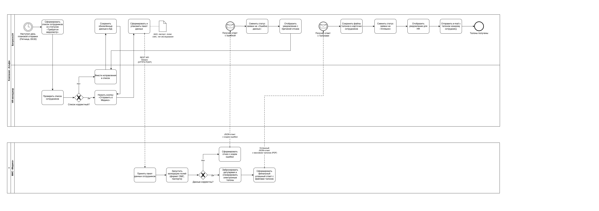

# Кейс: Автоматизация процесса прохождения медосмотров сотрудников компании «Альфа»

## 1. Список вопросов для интервью с заказчиком

Для проектирования системы автоматизации необходимо провести интервью с двумя ключевыми сторонами процесса: представителями нашей компании (HR-департамент) и техническими специалистами медицинского центра.

### 🏢 Вопросы к Бизнес-заказчику (HR-департамент компании «Альфа»)
* **Текущий процесс (As-Is):** Как именно сейчас устроен процесс? Где и как собираются данные (Excel, бумажные анкеты)? Каким способом они передаются в медцентр сейчас (email, курьер, телефон)?
* **Объемы и регулярность:** Как часто отправляются списки на медосмотр (ежедневно, раз в неделю, по мере набора групп)? Какое среднее количество сотрудников в одной отправке?
* **Справочник обследований:** Существует ли утвержденная матрица соответствия должностей и типов медицинского обследования согласно законодательству? Где она хранится и кто её актуализирует?
* **Обработка ошибок:** Каков регламент действий HR-менеджера при получении отказа от клиники? Как происходит исправление данных и повторная отправка?

### 🏥 Вопросы к Техническим специалистам (Медицинский центр «Медико»)
* **Способ интеграции:** Поддерживает ли информационная система медцентра интеграцию через API (REST / SOAP)? Если нет, возможен ли обмен структурированными файлами (JSON / XML / CSV) через защищенный FTP-сервер?
* **Формат и структура талонов:** В каком виде система клиники возвращает талоны (готовые файлы PDF, текстовые данные с датой/временем, или ссылки на личный кабинет)?
* **Формат и валидация ошибок:** Каким образом передаются причины отказа? Возвращается ли конкретное поле с ошибкой (например, "Неверный формат полиса ОМС"), или это общая текстовая ошибка?
* **Информационная безопасность:** Какие технические требования предъявляются к каналу передачи персональных данных (ФЗ-152)? Требуется ли организация шифрованного VPN-туннеля между нашими системами?

### 🌐 Концепция технической реализации (Интеграция)
Процесс автоматизируется за счет интеграции двух систем:
1. **Система-донор (Компания «Альфа»):** Корпоративный портал **Битрикс24** (модуль Управления персоналом/КЭДО), где хранятся карточки сотрудников и паспортные данные.
2. **Система-приемник (Медцентр «Медико»):** Внутренняя медицинская информационная система (МИС) клиники.

**Механизм взаимодействия:** Синхронный или асинхронный обмен данными через **REST API** по защищенному каналу связи (с использованием протокола HTTPS и шифрования данных). HR-менеджеру достаточно нажать кнопку в интерфейсе Битрикс24, чтобы запустить автоматический обмен.

---

## 2. Данные, необходимые для автоматизации процесса

Для автоматизации обмена данными необходимо настроить передачу структурированной информации из кадровой системы компании «Альфа» в информационную систему медцентра «Медико».

### 📋 Таблица входящих данных (Сведения о сотрудниках)

| Название поля | Тип данных | Описание / Формат | Источник данных в компании |
| :--- | :--- | :--- | :--- |
| **Фамилия** | Строка (String) | Текстовое поле, до 100 символов | Кадровая система (Карточка сотрудника) |
| **Имя** | Строка (String) | Текстовое поле, до 100 символов | Кадровая система (Карточка сотрудника) |
| **Отчество** | Строка (String) | Текстовое поле, до 100 символов (опционально) | Кадровая система (Карточка сотрудника) |
| **Дата рождения** | Дата (Date) | Формат: YYYY-MM-DD | Кадровая система (Карточка сотрудника) |
| **Серия паспорта** | Строка (String) | 4 цифры (для РФ) | Кадровая система (Паспортные данные) |
| **Номер паспорта** | Строка (String) | 6 цифр (для РФ) | Кадровая система (Паспортные данные) |
| **Полис ОМС** | Строка (String) | 16 цифр (единый образец) | Кадровая система (Документы) |
| **Должность** | Строка (String) | Название позиции (например, "Водитель") | Штатное расписание кадровой системы |
| **Тип обследования**| Строка (String) | Код или название из справочника Минздрава | Автоподбор на основе Должности |

### 🎟 Данные, ожидаемые в ответе от медцентра «Медико»:
1. **Статус обработки запроса** (Строка: `Успешно` / `Ошибка`).
2. **Код ошибки и описание причины отказа** (если статус `Ошибка`, например: *"Некорректный номер полиса ОМС"*).
3. **Массив талонов** (если статус `Успешно`), где для каждого сотрудника возвращается:
   * Идентификатор талона (ID)
   * Дата и время приема
   * Номер кабинета или ФИО врача
   * Ссылка на скачивание электронного талона (PDF)

---

## 3. Схема бизнес-процесса автоматизации

Для моделирования процесса взаимодействия выбрана нотация **BPMN 2.0 (Business Process Model and Notation)**.

**Аргументация выбора:**
Процесс медосмотра является сквозным бизнес-процессом, в котором задействованы как люди (HR-менеджер), так и несколько информационных систем (Битрикс24 и МИС Клиники). Нотация BPMN 2.0 позволяет наглядно разделить зоны ответственности с помощью дорожек (Pools/Lanes) и детально показать логику ветвления процесса при возникновении ошибок валидации данных.

---

## 4. Функциональные и нефункциональные требования

### Функциональные требования (ФТ)

* **ФТ-1 (Сбор данных):** Система должна автоматически агрегировать персональные и кадровые данные новых сотрудников (ФИО, дата рождения, серия/номер паспорта, полис ОМС, должность) из модуля КЭДО Битрикс24.
* **ФТ-2 (Регламентный запуск):** Система должна автоматически запускать сбор списка сотрудников раз в неделю (каждую пятницу в 09:00) по внутреннему таймеру (Cron-задаче).
* **ФТ-3 (Матрица обследований):** Система должна автоматически сопоставлять должность сотрудника с типом медицинского обследования на основе встроенного справочника (согласно Приказу Минздрава № 29н).
* **ФТ-4 (Интерфейс HR):** Система должна предоставлять HR-менеджеру экранную форму для просмотра сформированного списка, ручной корректировки данных и запуска отправки пакета по кнопке «Отправить в медцентр».
* **ФТ-5 (Валидация на клиенте):** Система должна осуществлять масочную проверку корректности ввода данных (строго 10 цифр для паспорта, 16 цифр для ОМС) перед отправкой запроса в клинику.
* **ФТ-6 (Интеграция с МИС):** Система должна передавать пакет данных сотрудников в МИС медцентра «Медико» по протоколу REST API (метод POST, формат JSON) и асинхронно ожидать ответ.
* **ФТ-7 (Сохранение результатов):** При получении успешного ответа от клиники система должна извлечь ссылки на PDF-файлы талонов, прикрепить их в карточки сотрудников в БД Битрикс24 и перевести статус заявки в «Успешно».
* **ФТ-8 (Оповещение сотрудников):** После сохранения талонов система должна автоматически отправить email-уведомление с вложенным файлом талона (PDF) на личную корпоративную почту каждого сотрудника из списка.
* **ФТ-9 (Обработка ошибок):** При получении ответа об отказе от клиники система должна изменить статус заявки на «Ошибка данных», вывести на экран HR-менеджера всплывающее окно (алерт) с описанием причины отказа и подсветить некорректно заполненные поля.
* **ФТ-10 (Перенос неявившихся):** Система должна автоматически отслеживать просроченные талоны, по которым не пришло подтверждение от клиники, и возвращать сотрудников в статус «Требуется медосмотр» для включения в следующий плановый пакет отправки.

### Нефункциональные требования (НФТ)

* **НФТ-1 (Безопасность и защита ПД):** Все передаваемые данные должны шифроваться по протоколу HTTPS с использованием TLS версии не ниже 1.3. Система должна полностью соответствовать требованиям Федерального закона РФ № 152-ФЗ «О персональных данных».
* **НФТ-2 (Производительность / Время ответа):** Время обработки синхронного API-запроса на стороне МИС «Медико» (включая проверку полей и генерацию массива талонов) не должно превышать 10 секунд для пакета объемом до 50 сотрудников.
* **НФТ-3 (Надежность / Отказоустойчивость):** В случае временной недоступности серверов медцентра «Медико» Битрикс24 должен перевести пакет в статус «В очереди на отправку» и автоматически повторять попытки отправки каждые 30 минут (но не более 5 раз), после чего уведомить администратора.
* **НФТ-4 (Режим работы и доступность):** Модуль управления медосмотрами в интерфейсе Битрикс24 должен быть доступен для HR-менеджеров в режиме 24/7, за исключением плановых окон технического обслуживания (не более 2 часов в месяц в нерабочее время).
* **НФТ-5 (Масштабируемость):** Архитектура модуля в Битрикс24 должна поддерживать обработку и хранение данных о медосмотрах при росте штата компании до 5000+ сотрудников без снижения производительности интерфейса.

---

## 5. Сущности Базы Данных (БД)

Для реализации модуля автоматизации медосмотров в базе данных Битрикс24 необходимо спроектировать три основные таблицы (сущности) и настроить логические связи между ними.

### 1. Таблица `employee` (Сотрудники)
Хранит актуальные персональные и кадровые сведения о работниках компании «Альфа».
* `employee_id` (BigInt, Primary Key) — Уникальный внутренний идентификатор сотрудника (генерируется системой автоматически).
* `last_name` (Varchar 100) — Фамилия.
* `first_name` (Varchar 100) — Имя.
* `middle_name` (Varchar 100) — Отчество (необязательное поле).
* `birth_date` (Date) — Дата рождения.
* `passport_series` (Varchar 4) — Серия паспорта РФ (строго 4 цифры).
* `passport_number` (Varchar 6) — Номер паспорта РФ (строго 6 цифр).
* `oms_number` (Varchar 16) — Номер полиса ОМС (строго 16 цифр).
* `position_name` (Varchar 150) — Название текущей должности сотрудника.
* `need_checkup` (Boolean) — Флаг-маркер автоматического отбора (принимает значение `True`, если сотруднику назначен медосмотр).
* `medical_checkup_type` (Varchar 100) — Автоматически подобранный тип медицинского обследования согласно должности (например, "Приказ 29н, п. 18.2 — Работы на высоте").
  
### 2. Таблица `medical_order` (Заявки на медосмотр)
Хранит информацию о пакетных запросах, которые Битрикс24 отправляет в медцентр «Медико».
* `order_id` (BigInt, Primary Key) — Уникальный номер отправленного пакета / заявки.
* `creation_date` (Timestamp) — Дата и время автоматического формирования списка по таймеру.
* `sent_date` (Timestamp) — Фактическая дата и время отправки данных в клинику по кнопке HR.
* `status` (Varchar 30) — Текущий статус заявки в системе (варианты: `Черновик`, `В очереди`, `Отправлено`, `Успешно`, `Ошибка данных`).
* `error_message` (Text) — Текст ошибки, присланный роботом клиники в случае отказа (необязательное поле).
* `hr_manager_id` (BigInt) — Идентификатор HR-менеджера, подтвердившего отправку списка.

### 3. Таблица `medical_ticket` (Талоны на обследование)
Хранит сведения о талонах, полученных в успешных ответах от МИС медцентра «Медико».
* `ticket_id` (BigInt, Primary Key) — Уникальный номер талона.
* `order_id` (BigInt, Foreign Key) — Идентификатор пакетной заявки, в рамках которой получен талон (связь с таблицей `medical_order`).
* `employee_id` (BigInt, Foreign Key) — Идентификатор сотрудника, которому принадлежит талон (связь с таблицей `employee`).
* `appointment_datetime` (Timestamp) — Назначенные клиникой дата и время приема.
* `cabinet_number` (Varchar 50) — Номер кабинета или ФИО принимающего врача.
* `pdf_file_url` (Varchar 500) — Прямая защищенная ссылка на скачивание электронного талона в формате PDF.
* `confirmed_checkup_type (Varchar 100)` — Утвержденный клиникой тип обследования, зафиксированный в выданном талоне.

---

### 🔄 Логические связи между сущностями (Схема связей)

Для правильной работы базы данных и исключения дублирования информации настраиваются следующие типы связей:

1. **Связь `employee` ──> `medical_ticket` (Тип 1:M — «Один ко многим»)**
   * *Логика:* Один конкретный сотрудник за время своей работы в компании «Альфа» может проходить медосмотр несколько раз в разные годы (то есть иметь много талонов в истории БД). При этом один конкретный талон всегда жестко привязан только к одному уникальному сотруднику. Связующим полем выступает `employee_id`.

2. **Связь `medical_order` ──> `medical_ticket` (Тип 1:M — «Один ко многим»)**
   * *Логика:* Одна пакетная еженедельная заявка от компании содержит в себе массив из множества выданных клиникой талонов для всей группы отправленных людей. При этом каждый талон может быть получен строго в рамках одной конкретной отправленной заявки. Связующим полем выступает `order_id`.

---

---

## 6. Ограничения и риски реализации

При проектировании и технической реализации модуля автоматизации медосмотров необходимо учитывать следующие ключевые ограничения и риски:

1. **Юридические ограничения (Федеральный закон РФ № 152-ФЗ «О персональных данных»):**
Передаваемый пакет данных содержит персональные данные (ФИО, паспорта, полисы ОМС). Компания «Альфа» не имеет права передавать их по API в медцентр без предварительного подписания сотрудником бумажного «Согласия на обработку персональных данных и передачу их третьим лицам». Отсутствие подписанного согласия блокирует отправку данных на уровне закона.

2. **Зависимость от доступности стороннего API (Внешний риск):**
Скорость и стабильность работы модуля полностью зависят от работоспособности ИТ-системы медцентра «Медико». Если сервер клиники будет недоступен или перегружен, Битрикс24 не сможет оперативно выдать талоны. Для снижения риска спроектирован механизм автоматической очереди повторных запросов (НФТ-3).

3. **Синхронизация кадровых справочников:**
Автоматический подбор обследований жестко завязан на название должности. Если HR-отдел компании «Альфа» заведет в Битрикс24 новую должность (например, «Младший оператор склада»), но забудет внести её в матрицу соответствия Приказу 29н, система выдаст ошибку и не сможет сформировать пакет для клиники. Требуется строгий регламент ведения справочников.

4. **Физическая пропускная способность клиники (Квоты):**
Медцентр «Медико» имеет физические лимиты на количество свободных врачей и кабинетов в день. Если Битрикс24 отправит в один понедельник список сразу на 300+ человек, клиника может вернуть ошибку из-за отсутствия свободных слотов. В будущем необходимо согласовать и заложить в код лимиты (квоты) на максимальное количество человек в одной недельной заявке.

5. **Ограничение границ проекта (Out of Scope):**
Текущий MVP-модуль автоматизирует только этап *направления* на медосмотр и выдачу талонов. Сбор, хранение и обработка медицинских результатов (заключений профпригодности) полностью вынесены за рамки проекта, так как они составляют медицинскую тайну и требуют проектирования отдельного изолированного контура безопасности.
